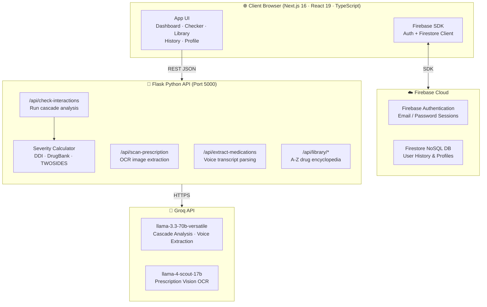

# MedTrack — Health Intelligence Platform

**Clinical-grade AI that detects the Prescription Cascade before it harms you.**

*Built for patients, caregivers, and clinical decision support researchers.*

**Live Deployment:** [MedTrack on Vercel](https://medtrack-coral.vercel.app/) (Replace with actual link)

---

## Table of Contents

- [Overview](#overview)
- [Screenshots](#screenshots)
- [Architecture](#architecture)
- [Project Structure](#project-structure)
- [Installation & Setup](#installation--setup)
- [Running the Application](#running-the-application)
- [Test Accounts](#test-accounts)
- [Demo](#demo)
- [Tech Stack](#tech-stack)
- [Clinical Disclaimer](#clinical-disclaimer)

---

## Overview

A **Prescription Cascade** happens when the side effect of one drug is mistaken for a new condition, prompting a second prescription — which creates its own side effects, leading to a third, and so on. Standard pharmacy software only checks two drugs at a time and completely misses these compounding chain reactions.

**MedTrack is built to fix that.**

It ingests your complete medication list, cross-references three drug-interaction databases (DDI, DrugBank, TWOSIDES), runs a multi-stage AI analysis, and calculates a clinical severity score — all in one place.

### Key Features

**AI Cascade Checker**
The core of MedTrack. Submit your medication list and the system runs a 3-tier LLM analysis powered by `llama-3.3-70b-versatile` via Groq. You get a brief side-effect summary, a contextual interaction paragraph, and a full human-readable clinical report — each escalating in depth.

**Prescription OCR Scanner**
Upload a photo of any paper or digital prescription. The `llama-4-scout-17b` vision model reads the image, extracts every drug name and dosage, and identifies the likely prescribing specialist — with no manual entry required.

**Voice Dictation**
Speak your medications aloud directly into the browser. The Web Speech API captures a live transcript and the backend AI extracts a structured medication list from your natural language.

**Drug Library**
Browse a searchable A-Z encyclopedia of over 2,000 drugs sourced from multiple clinical datasets. Each entry includes known interactions, severity ratings, and cross-references.

**Cloud History Sync**
Every analysis you run is saved instantly to browser `localStorage` and asynchronously backed up to Firestore. Your history is available across devices and is never lost.

**PDF Report Export**
Generate a professionally formatted, branded PDF of any analysis — including the medication table, risk charts, and the full clinical report. Ready to share with your doctor.

**Multi-language Analysis**
Switch the entire AI output between English, Hindi, and Marathi in real time. Designed to make clinical information accessible to a wider audience.

**Read Aloud**
The Web Speech Synthesis API narrates the complete analysis report in the selected language — useful for accessibility and hands-free review.

**Interactive Risk Dashboard**
A visual home base that shows animated safety and risk scores, a log of recent analyses, and live severity status panels — all powered by Recharts.

---

## Screenshots

> **Dashboard — Interactive Risk Overview**

<!-- Drop your dashboard screenshot here -->
<br><br>

> **AI Cascade Checker — 3-Tier Analysis Report**

<!-- Drop your checker screenshot here -->
<br><br>

> **Prescription OCR Scanner**

<!-- Drop your OCR scanner screenshot here -->
<br><br>

> **Drug Library — A-Z Encyclopedia**

<!-- Drop your drug library screenshot here -->
<br><br>

> **Voice Dictation — Live Transcript**

<!-- Drop your voice dictation screenshot here -->
<br><br>

---

## Architecture



<br>

### Component Breakdown

| Component | Functionality |
|---|---|
| **Client Browser** | Renders the Next.js 16 App Router UI. Handles client-side routing, state, and direct Firebase SDK calls for auth and history. |
| **Firebase Authentication** | Manages email/password login and signup. Persists user sessions in the browser with no server round-trip required. |
| **Firestore DB** | Stores user analysis history and profile data as NoSQL documents. Acts as the cloud backup in the dual-write system. |
| **Flask API** | Processes all backend logic — receives medication lists, queries the drug datasets, calculates algorithmic severity, and orchestrates Groq API calls. |
| **Severity Calculator** | Cross-references DDI, DrugBank, and TWOSIDES datasets to find pairwise interactions and compute a `Safe / Moderate / High / Critical` score. |
| **`/api/check-interactions`** | Receives the medication list + patient context, computes severity, then sends a structured prompt to `llama-3.3-70b` for the 3-tier analysis. |
| **`/api/scan-prescription`** | Accepts a base64-encoded prescription image and sends it to the `llama-4-scout-17b` vision model to extract drug names, doses, and specialist type. |
| **`/api/extract-medications`** | Receives a raw voice dictation transcript and uses `llama-3.3-70b` to parse it into a structured medication list. |
| **`/api/library/*`** | Serves the full A-Z drug index and individual drug interaction records from the local DDI/DrugBank JSON database. |
| **Groq API — llama-3.3-70b** | Performs the core pharmacological reasoning: generates Short, Medium, and Detailed analysis reports and extracts medications from speech transcripts. |
| **Groq API — llama-4-scout-17b** | Handles multimodal vision inference — reads prescription images and returns structured JSON medication data. |

---

## Project Structure

```
Med_Track/
│
├── api/                           # Flask Backend
│   ├── index.py                   # Main API server (all endpoints)
│   ├── data_parser.py             # Drug dataset loader & query engine
│   ├── analyzer.py                # Algorithmic severity calculator
│   ├── drugs_database.json        # Local DDI drug database (JSON)
│   └── data/                      # Raw datasets (DrugBank, TWOSIDES)
│
├── src/                           # Next.js Frontend
│   ├── app/
│   │   ├── page.tsx               # Landing page
│   │   ├── layout.tsx             # Root layout (fonts, metadata)
│   │   ├── globals.css            # Global Tailwind styles
│   │   ├── login/                 # Login page
│   │   ├── signup/                # Signup page
│   │   └── dashboard/
│   │       ├── page.tsx           # Main dashboard
│   │       ├── layout.tsx         # Dashboard shell (Sidebar + TopBar)
│   │       ├── checker/           # AI Cascade Checker page
│   │       ├── history/           # Cloud history page
│   │       ├── library/           # Drug library page
│   │       └── profile/           # User profile page
│   │
│   ├── components/
│   │   └── dashboard/
│   │       ├── Sidebar.tsx        # Navigation sidebar
│   │       └── TopBar.tsx         # Header / topbar
│   │
│   └── lib/
│       ├── firebase.ts            # Firebase SDK initialization
│       ├── historyService.ts      # Dual-write history (localStorage + Firestore)
│       └── analysisService.ts     # API call wrappers for the Flask backend
│
├── requirements.txt               # Python dependencies (pinned versions)
├── package.json                   # Node dependencies
├── .env                           # Backend secrets (git-ignored)
├── .env.local                     # Frontend secrets (git-ignored)
├── next.config.ts                 # Next.js configuration
└── tsconfig.json                  # TypeScript configuration
```

---

## Installation & Setup

### Prerequisites

| Requirement | Version | Notes |
|---|---|---|
| **Node.js** | ≥ 18.x | [nodejs.org](https://nodejs.org/) |
| **Python** | ≥ 3.10 | [python.org](https://python.org/) |
| **Groq API Key** | — | Free at [console.groq.com](https://console.groq.com/) |
| **Firebase Project** | — | [console.firebase.google.com](https://console.firebase.google.com/) — enable **Email/Password Auth** and **Firestore** |

---

### Step 1 — Clone the Repository

```bash
git clone https://github.com/your-username/Med_Track.git
cd Med_Track
```

---

### Step 2 — Backend Setup (Flask)

> Run all commands from the **project root** (`Med_Track/`).

**Create and activate a virtual environment:**

```bash
# Windows (PowerShell)
python -m venv venv
.\venv\Scripts\activate

# macOS / Linux
python3 -m venv venv
source venv/bin/activate
```

Your terminal prompt will show `(venv)` when the environment is active.

**Install Python dependencies:**

```bash
pip install -r requirements.txt
```

**Create the `.env` file** in the project root:

```env
# .env — backend secrets, never commit this file
GROQ_API_KEY=gsk_your_groq_api_key_here
```

---

### Step 3 — Frontend Setup (Next.js)

Open a **new terminal** in the project root (keep the venv terminal open).

**Install Node dependencies:**

```bash
npm install
```

**Create the `.env.local` file** in the project root:

```env
# .env.local — frontend secrets, never commit this file

# Flask backend URL
NEXT_PUBLIC_API_URL=http://localhost:5000

# Firebase — find these in Firebase Console → Project Settings → Your apps → Web App
NEXT_PUBLIC_FIREBASE_API_KEY=your_firebase_api_key
NEXT_PUBLIC_FIREBASE_AUTH_DOMAIN=your-project-id.firebaseapp.com
NEXT_PUBLIC_FIREBASE_PROJECT_ID=your-project-id
NEXT_PUBLIC_FIREBASE_STORAGE_BUCKET=your-project-id.firebasestorage.app
NEXT_PUBLIC_FIREBASE_MESSAGING_SENDER_ID=your_sender_id
NEXT_PUBLIC_FIREBASE_APP_ID=your_app_id
```

---

## Running the Application

You need **two terminals** running at the same time:

| Terminal | Command | URL |
|---|---|---|
| **1 — Backend** | `flask --app api/index run --port 5000` | http://localhost:5000 |
| **2 — Frontend** | `npm run dev` | http://localhost:3000 |

> Start the Flask backend **first** — the dashboard makes API calls on initial load.

**Pre-flight checklist:**
- [ ] `(venv)` is active in Terminal 1
- [ ] `.env` has a valid `GROQ_API_KEY`
- [ ] `.env.local` has all 6 Firebase variables filled in
- [ ] Firebase project has **Email/Password** authentication enabled
- [ ] Firebase project has a **Firestore database** created (test or production mode)

---

## Test Accounts

For ease of review and testing, you can log in using the following test credentials without creating a new account:

| Account Type | Email | Password |
|---|---|---|
| **Demo Patient** | `patient@medtrack.demo` | `medtrack123` |
| **Clinical User** | `clinical@medtrack.demo` | `medtrack123` |

---

## Demo

| Resource | Link |
|---|---|
| Live Deployment | [MedTrack on Vercel](https://medtrack-coral.vercel.app/) |
| Video Demo | *(Insert YouTube / Vimeo link here)* |

---

## Tech Stack


<br>


---

## Clinical Disclaimer

> **MedTrack is NOT a medical device.**
>
> This platform is an educational and clinical decision support tool only. It does not constitute medical advice, diagnosis, or treatment. The AI-generated analysis is intended to supplement — not replace — the professional judgment of a licensed physician or pharmacist.
>
> **Always consult a qualified healthcare professional before making any changes to your medication regimen.**

---

© 2026 MedTrack · Made with care for safer medicine management.
